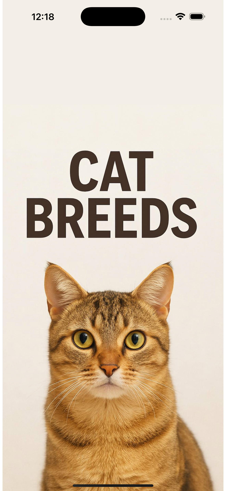
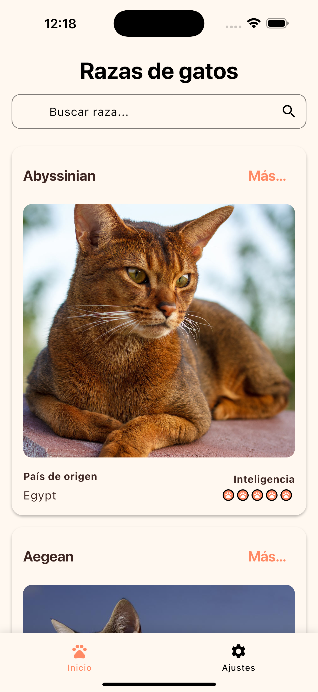
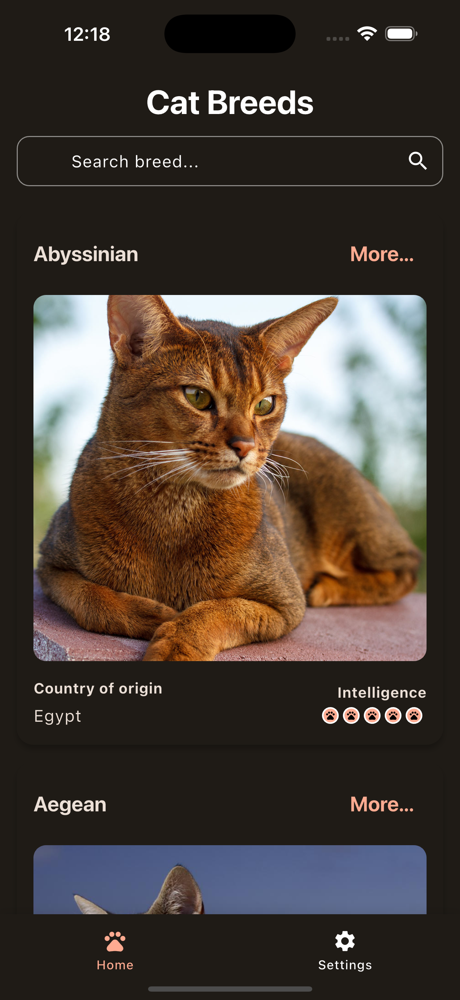
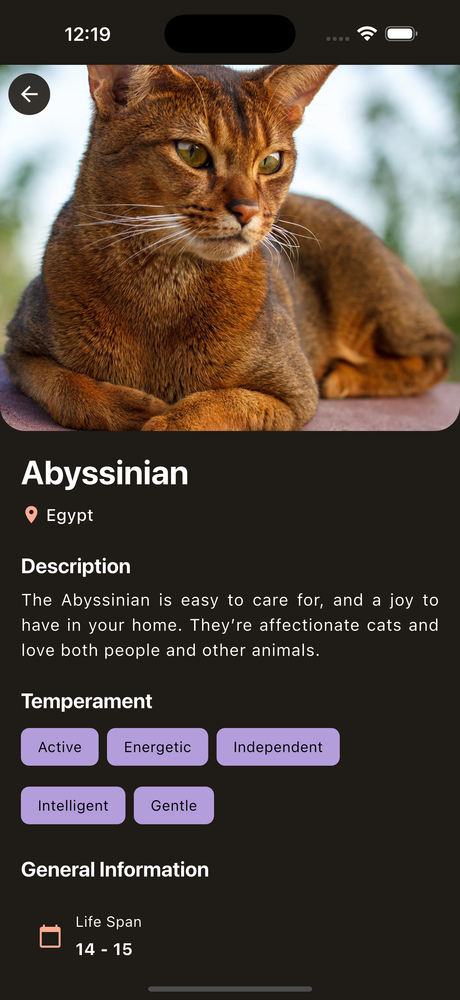

# 🐱 Cat Lover App

<div align="center">


Una aplicación móvil elegante para explorar y conocer diferentes razas de gatos del mundo. Construida con las mejores prácticas de desarrollo y una arquitectura robusta.

</div>

---

## 📋 Tabla de Contenidos

- [Características](#-características)
- [Arquitectura](#-arquitectura)
- [Tecnologías](#-tecnologías)
- [Prerequisitos](#-prerequisitos)
- [Instalación](#-instalación)
- [Configuración](#-configuración)
- [Estructura del Proyecto](#-estructura-del-proyecto)
- [Patrones de Diseño](#-patrones-de-diseño)
- [CI/CD](#-cicd-pipeline)

---

## ✨ Características

### Funcionalidades Principales

- 🔍 **Exploración de Razas**: Navega por un catálogo completo de razas de gatos con información detallada
- 🔎 **Búsqueda en Tiempo Real**: Filtra razas de gatos mientras escribes
- 📱 **Diseño Responsivo**: Interfaz adaptable a diferentes tamaños de pantalla
- 🌐 **Multiidioma**: Soporte completo para español e inglés
- 🎨 **Temas Personalizables**: Modo claro y oscuro con persistencia de preferencias
- 📊 **Información Detallada**: Visualiza características, temperamento, nivel de inteligencia y más
- 🖼️ **Imágenes Optimizadas**: Carga de imágenes con caché para mejor rendimiento
- 🔗 **Enlaces Externos**: Acceso directo a Wikipedia para información adicional

### Características Técnicas

- 🏗️ **Arquitectura Híbrida**: Combinación de Clean Architecture y MVVM
- 🔄 **Gestión de Estado**: GetX para un manejo eficiente y reactivo del estado
- 🧪 **Cobertura de Tests**: Mínimo 90% de cobertura en pruebas unitarias
- 🔐 **Variables de Entorno**: Configuración segura mediante archivos `.env`
- ⚡ **Generación de Código**: Build Runner para serialización JSON automática
- 🎯 **Inyección de Dependencias**: Arquitectura desacoplada y testeable
- 🎨 **Diseño Atómico**: Componentes reutilizables y escalables
- 🚀 **CI/CD**: Pipeline automatizado con GitHub Actions

---

## 🏗️ Arquitectura

Esta aplicación implementa una **arquitectura híbrida** que combina los beneficios de **Clean Architecture** con el patrón **MVVM (Model-View-ViewModel)**.

### Diagrama de Arquitectura

```
┌─────────────────────────────────────────────────────────────┐
│                        PRESENTATION                         │
│  ┌──────────┐      ┌──────────┐      ┌──────────┐           │
│  │  Views   │ ←──→ │ViewModel │ ←──→ │  Widgets │           │
│  │ (UI)     │      │ (GetX)   │      │ (Atomic) │           │
│  └──────────┘      └──────────┘      └──────────┘           │
└─────────────────────────────────────────────────────────────┘
                              ↕
┌─────────────────────────────────────────────────────────────┐
│                         DOMAIN                              │
│  ┌──────────────────┐      ┌──────────────────┐             │
│  │   Repositories   │      │     Models       │             │
│  │  (Interfaces)    │      │   (Entities)     │             │
│  └──────────────────┘      └──────────────────┘             │
└─────────────────────────────────────────────────────────────┘
                              ↕
┌─────────────────────────────────────────────────────────────┐
│                          DATA                               │
│  ┌──────────────────┐      ┌──────────────────┐             │
│  │  Repository      │      │  Data Sources    │             │
│  │ Implementation   │ ←──→ │  (API/Local)     │             │
│  └──────────────────┘      └──────────────────┘             │
└─────────────────────────────────────────────────────────────┘
                              ↕
┌─────────────────────────────────────────────────────────────┐
│                          CORE                               │
│          ┌──────────┐  ┌──────────┐  ┌──────────┐           │
│          │ Network  │  │  Storage │  │  Config  │           │
│          └──────────┘  └──────────┘  └──────────┘           │
└─────────────────────────────────────────────────────────────┘
```

### Capas de la Arquitectura

#### 1. **Presentation Layer (Presentación)**

- **Views**: Widgets de Flutter que representan la interfaz de usuario
- **ViewModels**: Controladores GetX que manejan la lógica de presentación y el estado
- **Widgets**: Componentes reutilizables siguiendo diseño atómico

#### 2. **Domain Layer (Dominio)**

- **Repository Interfaces**: Contratos que definen las operaciones de datos
- **Models/Entities**: Modelos de dominio que representan las entidades de negocio

#### 3. **Data Layer (Datos)**

- **Repository Implementations**: Implementaciones concretas de los repositorios
- **Data Sources**: Fuentes de datos (API REST, almacenamiento local)

#### 4. **Core Layer (Núcleo)**

- **Network**: Cliente HTTP (Dio) y configuración de red
- **Storage**: Servicios de almacenamiento local (GetStorage)
- **Config**: Variables de entorno y configuraciones

### Flujo de Datos

```
User Interaction → View → ViewModel → Repository → Data Source → API
                                           ↓
                                        Models
                                           ↓
                                     ViewModel ← Observable State
                                           ↓
                                         View (Update UI)
```

---

## 🛠️ Tecnologías

### Core

| Tecnología  | Versión | Propósito                               |
| ----------- | ------- | --------------------------------------- |
| **Flutter** | 3.32.0  | Framework de desarrollo multiplataforma |
| **Dart**    | 3.8.0+  | Lenguaje de programación                |
| **GetX**    | 4.7.2   | Gestión de estado, rutas y dependencias |

### Networking & Data

| Paquete                  | Versión | Propósito                              |
| ------------------------ | ------- | -------------------------------------- |
| **dio**                  | 5.9.0   | Cliente HTTP para comunicación con API |
| **json_annotation**      | 4.9.0   | Anotaciones para serialización JSON    |
| **json_serializable**    | 6.8.0   | Generación automática de código JSON   |
| **cached_network_image** | 3.4.1   | Carga y caché de imágenes              |

### Storage & Config

| Paquete            | Versión | Propósito                        |
| ------------------ | ------- | -------------------------------- |
| **get_storage**    | 2.1.1   | Almacenamiento local persistente |
| **flutter_dotenv** | 5.2.1   | Gestión de variables de entorno  |

### UI & UX

| Paquete             | Versión | Propósito                 |
| ------------------- | ------- | ------------------------- |
| **cupertino_icons** | 1.0.8   | Iconos estilo iOS         |
| **url_launcher**    | 6.3.1   | Apertura de URLs externas |

### Development Tools

| Paquete                    | Versión | Propósito                            |
| -------------------------- | ------- | ------------------------------------ |
| **build_runner**           | 2.4.7   | Generación de código mediante macros |
| **flutter_lints**          | 5.0.0   | Reglas de linting recomendadas       |
| **flutter_launcher_icons** | 0.14.4  | Generación de iconos de aplicación   |
| **mocktail**               | 1.0.4   | Framework de mocking para tests      |

---

## 📦 Prerequisitos

Antes de comenzar, asegúrate de tener instalado:

- **Flutter SDK**: >= 3.32.0
- **Dart SDK**: >= 3.8.0
- **Android Studio** / **Xcode** (según plataforma objetivo)
- **Git**
- **API Key de The Cat API**: [Obtener aquí](https://thecatapi.com/)

---

## 🚀 Instalación

### 1. Clonar el repositorio

```bash
git clone https://github.com/IvanCardona01/cat_lover_app.git
cd cat_lover_app
```

### 2. Instalar dependencias

```bash
flutter pub get
```

### 3. Configurar variables de entorno

Crea un archivo `.env` en la raíz del proyecto:

```bash
touch .env
```

Agrega las siguientes variables:

```env
BASE_URL=https://api.thecatapi.com
API_KEY=tu_api_key_aqui
STORAGE_NAME=cat_lover_app
```

> ⚠️ **Importante**: Nunca compartas tu API key públicamente ni la subas a control de versiones.

### 4. Generar código

Ejecuta build_runner para generar los archivos de serialización JSON:

```bash
dart run build_runner build --delete-conflicting-outputs
```

### 5. Ejecutar la aplicación

```bash
flutter run
```

### 6. (Opcional) Generar iconos de aplicación

Si modificas el icono de la aplicación:

```bash
dart run flutter_launcher_icons:generate
```

---

## ⚙️ Configuración

### Variables de Entorno

El proyecto utiliza `flutter_dotenv` para gestionar configuraciones sensibles:

### Configuración de Red

Cliente Dio configurado con interceptores para headers y manejo de errores:

```dart
// lib/core/network/clients/dio_client.dart
- BaseURL: Configurada desde variables de entorno
- Timeout: 15 segundos (conexión y recepción)
- Interceptor: Inyección automática de API key en headers
```

### Temas

Soporte para modo claro y oscuro con persistencia de preferencias:

```dart
// lib/app/theme/theme.dart
- Tema Claro: Paleta cálida con tonos coral y ámbar
- Tema Oscuro: Paleta suave con tonos lavanda y dorado
- Material 3: Diseño moderno y componentes actualizados
```

---

## 📁 Estructura del Proyecto

```
lib/
├── app/                          # Configuración global de la aplicación
│   ├── app.dart                  # Widget principal de la aplicación
│   ├── routes/                   # Sistema de navegación
│   │   ├── app_routes.dart       # Definición de rutas
│   │   └── app_page.dart         # Páginas y bindings
│   ├── theme/                    # Temas de la aplicación
│   │   └── theme.dart            # Configuración de temas claro/oscuro
│   └── translations/             # Internacionalización
│       ├── app_translations.dart # Configuración de traducciones
│       └── locale/               # Archivos de idiomas
│           ├── en_translation.dart
│           └── es_translation.dart
│
├── core/                         # Funcionalidades centrales compartidas
│   ├── core_binding.dart         # Inyección de dependencias core
│   ├── config/                   # Configuraciones
│   │   └── env.dart              # Variables de entorno
│   ├── network/                  # Capa de red
│   │   ├── clients/              # Clientes HTTP
│   │   │   └── dio_client.dart   # Configuración de Dio
│   │   ├── data/                 # Implementaciones de repositorios
│   │   │   └── dio_network_repository_impl.dart
│   │   ├── domain/               # Interfaces de repositorios
│   │   │   └── network_repository.dart
│   │   ├── models/               # Modelos compartidos
│   │   │   └── result.dart       # Patrón Result para manejo de errores
│   │   └── endpoints.dart        # Definición de endpoints API
│   └── local_storage/            # Almacenamiento local
│       ├── data/                 # Implementación
│       │   └── get_local_storage_service_impl.dart
│       └── domain/               # Interfaz
│           └── local_storage_service.dart
│
├── features/                     # Módulos de funcionalidades
│   ├── home/                     # Módulo de inicio (lista de razas)
│   │   ├── bindings/             # Inyección de dependencias
│   │   │   └── breed_details_binding.dart
│   │   ├── data/                 # Capa de datos
│   │   │   └── home_repository_impl.dart
│   │   ├── domain/               # Capa de dominio
│   │   │   └── home_repository.dart
│   │   ├── models/               # Modelos de datos
│   │   │   ├── breed_model_response.dart
│   │   │   └── breed_model_response.g.dart
│   │   ├── viewmodels/           # Lógica de presentación (MVVM)
│   │   │   ├── home_viewmodel.dart
│   │   │   └── breed_details_viewmodel.dart
│   │   ├── views/                # Pantallas
│   │   │   ├── home_view.dart
│   │   │   └── breed_details_view.dart
│   │   └── widgets/              # Componentes específicos
│   │       ├── breed_cualitites_bar.dart
│   │       ├── breed_cualitites.dart
│   │       ├── breed_info_card.dart
│   │       └── breed_life_style.dart
│   │
│   ├── settings/                 # Módulo de configuración
│   │   ├── data/                 # Implementación de repositorio
│   │   ├── domain/               # Interfaz de repositorio
│   │   ├── viewmodels/           # ViewModel de settings
│   │   └── views/                # Vista de configuración
│   │
│   └── tab_bar/                  # Navegación principal
│       ├── bindings/             # Inyección de dependencias
│       ├── viewmodels/           # ViewModel de tabs
│       └── views/                # Vista de tabs
│
├── shared/                       # Recursos compartidos
│   ├── bases/                    # Clases base
│   │   └── base_viewmodel.dart   # ViewModel base con funciones comunes
│   ├── constants/                # Constantes globales
│   ├── models/                   # Modelos compartidos
│   ├── utils/                    # Utilidades
│   │   └── theme_convertions_util.dart
│   └── widgets/                  # Widgets reutilizables (Atomic Design)
│       ├── breed_image.dart      # Átomo: Componente de imagen
│       ├── cat_breed_card.dart   # Molécula: Tarjeta de raza
│       ├── empty_view.dart       # Organismo: Vista vacía
│       └── loading_view.dart     # Organismo: Vista de carga
│
└── main.dart                     # Punto de entrada de la aplicación
```

## 🎨 Patrones de Diseño

### 1. **MVVM (Model-View-ViewModel)**

El patrón MVVM separa la lógica de presentación de la interfaz de usuario:

**Ventajas:**

- ✅ Separación clara de responsabilidades
- ✅ Fácil testeo del ViewModel
- ✅ UI reactiva con observables de GetX
- ✅ Reutilización de lógica de negocio

### 2. **Repository Pattern**

Abstrae el acceso a datos mediante interfaces:

**Ventajas:**

- ✅ Desacoplamiento entre capas
- ✅ Fácil cambio de fuentes de datos
- ✅ Testeable con mocks
- ✅ Centralización de lógica de datos

### 3. **Dependency Injection**

GetX maneja la inyección de dependencias:

**Ventajas:**

- ✅ Gestión automática del ciclo de vida
- ✅ Lazy loading de dependencias
- ✅ Fácil sustitución en tests
- ✅ Código más limpio y mantenible

### 4. **Result Pattern**

Manejo de errores funcional y seguro:

**Ventajas:**

- ✅ Manejo explícito de errores
- ✅ Type-safe
- ✅ Evita excepciones no controladas
- ✅ Código más predecible

### 5. **Atomic Design**

Organización de componentes UI en niveles:

**Ventajas:**

- ✅ Componentes altamente reutilizables
- ✅ Fácil mantenimiento
- ✅ Consistencia visual
- ✅ Escalabilidad

### 6. **Singleton Pattern**

Instancias únicas compartidas globalmente:

**Ventajas:**

- ✅ Una sola instancia en toda la app
- ✅ Optimización de recursos
- ✅ Configuración centralizada

---

## 🔄 CI/CD Pipeline

El proyecto incluye un pipeline de GitHub Actions que garantiza la calidad del código.

### Workflow: Test Coverage

**Archivo**: `.github/workflows/test-coverage.yml`

**Trigger**: Pull requests hacia la rama `main`

### Pasos del Pipeline

```yaml
1. 📥 Checkout del código
└── Obtiene el código del repositorio

2. 🛠️ Configuración de Flutter
└── Instala Flutter SDK 3.32.0

3. 🔐 Creación de archivo .env
└── Genera variables de entorno desde GitHub Secrets

4. 📦 Instalación de dependencias
└── Ejecuta flutter pub get

5. 🧪 Ejecución de tests con cobertura
└── Ejecuta flutter test --coverage

6. 📊 Verificación de cobertura
└── Valida que la cobertura sea >= 90%
└── ✅ Aprueba si es >= 90%
└── ❌ Rechaza si es < 90%
```

### Configuración de Secrets

Configura los siguientes secrets en GitHub:

```
Settings → Secrets and variables → Actions → New repository secret
```

**Secrets requeridos:**

- `BASE_URL`: URL base de la API
- `API_KEY`: API key de The Cat API
- `STORAGE_NAME`: Nombre del almacenamiento local

### Protección de Rama

Recomendación para `main`:

```
Settings → Branches → Branch protection rules
```

- ✅ Require status checks to pass before merging
- ✅ Require branches to be up to date before merging
- ✅ Status checks: "Check Coverage for Cat Lover App of minimum 90%"

---

## 📱 Capturas de Pantalla

<div align="center">

### 🌟 Pantalla de Inicio



### 🏠 Vista Principal

<table>
  <tr>
    <td align="center">
      
      <br/>
      <sub><b>Tema Claro (ES)</b></sub>
    </td>
    <td align="center">
      
      <br/>
      <sub><b>Tema Oscuro (EN)</b></sub>
    </td>
  </tr>
</table>

### 🐱 Detalles de Raza

<table>
  <tr>
    <td align="center">
      
      <br/>
      <sub><b>Lista - Tema Claro (ES)</b></sub>
    </td>
    <td align="center">
      
      <br/>
      <sub><b>Detalles - Tema Oscuro (EN)</b></sub>
    </td>
  </tr>
</table>

</div>

---

## 👨‍💻 Autor

**Ivan Cardona**

- GitHub: [@IvanCardona01](https://github.com/IvanCardona01)

---

<div align="center">

**Hecho con ❤️ y Flutter**

</div>
